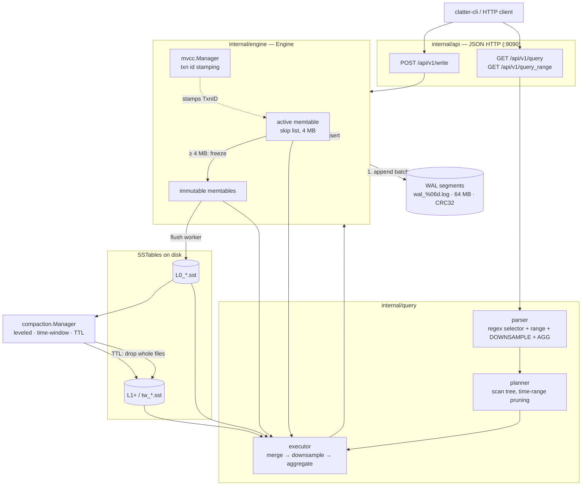

# ClatterDB — Time-Series Database Engine

A time-series storage engine written from scratch in Go: an **LSM-tree** on disk
(skip-list memtable → SSTable flush → leveled and time-window compaction, with
bloom filters), a **write-ahead log** with CRC-checked segments for crash
recovery, **MVCC** transaction stamping, a **query engine** (parser → planner →
executor) supporting range scans, downsampling and aggregation, and a
**consistent-hashing partitioner** for time-based sharding across nodes.

No storage library, no embedded KV: the memtable, the on-disk file format, the
bloom filter, the WAL record framing and the compaction policy are all
implemented directly.

> **Read this first.** This README documents what the code *does*, not what the
> design aspires to. Several subsystems are built but not yet wired into the
> running binary, and a few are deliberate simplifications. They are called out
> inline and summarised in [Implementation status](#implementation-status).
> Nothing below is aspirational unless it says so.

---

## Contents

- [Architecture](#architecture)
- [Storage engine](#storage-engine)
- [Write path](#write-path)
- [Read path](#read-path)
- [Compaction and retention](#compaction-and-retention)
- [MVCC](#mvcc)
- [Query language](#query-language)
- [Query planning and execution](#query-planning-and-execution)
- [HTTP API](#http-api)
- [Clustering](#clustering)
- [Configuration](#configuration)
- [Running it](#running-it)
- [Testing it](#testing-it)
- [Implementation status](#implementation-status)
- [Project layout](#project-layout)

---

## Architecture



A separate mux serves `/metrics` on `:9091` (default `promhttp` Go/process
collectors — there are no custom `clatterdb_*` metrics).

---

## Storage engine

### Memtable — skip list

`internal/storage/memtable` is a skip list ordered by the composite key
**`(seriesKey, timestamp)`**, max 16 levels, level promotion probability `0.25`.
Duplicate `(key, ts)` overwrites in place. Size accounting is approximate
(`len(key) + 24` bytes per sample) and the flush threshold is
`DefaultMaxSize = 4 MB`.

A range query descends the levels to the first node `>= (key, start)`, then
walks the level-0 chain forward, skipping tombstones and stopping as soon as the
key sorts past the target or the timestamp exceeds the end of the range.
`Iterator()` returns the whole level-0 chain already sorted, which is exactly
what the flush path needs — no sort on flush.

### SSTable

`internal/storage/sstable` writes a single self-describing file:

```
┌──────────────────────────────────────────────────┐
│ data     encoded samples, sorted by (key, ts)    │
├──────────────────────────────────────────────────┤
│ index    one entry per distinct series key:      │
│          [key_len u32][key][offset u64]          │
├──────────────────────────────────────────────────┤
│ bloom    [numBits u64][numHash u32][bits…]       │
├──────────────────────────────────────────────────┤
│ footer   48 bytes, big-endian:                   │
│          indexOffset u64 | bloomOffset u64       │
│          numSamples u64 | minTime u64            │
│          maxTime u64    | magic u64              │
└──────────────────────────────────────────────────┘
```

`magic = 0x434C415454455244` — the ASCII bytes `CLATTERD`. It is validated on
open, so a truncated or foreign file is rejected rather than misparsed.

Sample encoding is `[key_len u32][key][timestamp i64][value f64 bits][txn_id
u64][deleted u8]` = `17 + len(key)` bytes.

A point query is: **bloom check → footer time-range check → binary search the
in-memory index → read that key's byte extent → decode forward**. Three cheap
rejections before any real I/O.

### Bloom filter

`internal/storage/sstable/bloom.go`, sized per file from the distinct series
count at a target **1% false-positive rate**:
`numBits = -n·ln(p)/(ln2)²`, `numHash = ceil(numBits/n · ln2)` clamped to
`[1, 30]`. Hashing is **murmur3-128** run once per key, split into `(h1, h2)`,
then Kirsch–Mitzenmacher double hashing — `bit_i = (h1 + i·h2) mod numBits` —
so *k* hash positions cost one hash computation instead of *k*.

### Write-ahead log

`internal/storage/wal` writes records as
`[record_len u32][crc32 u32][payload]`, CRC over the payload only (IEEE), into
segments named `wal_%06d.log` that roll at **64 MB**. On startup the WAL scans
existing segments, resumes at `highest_seq + 1` and opens a fresh segment.

Recovery replays segments in ascending sequence order. A record whose CRC fails
or whose read comes up short ends that segment's replay, logs
`[wal] warning: partial replay of …`, and **replay continues with the next
segment** — a torn tail from an unclean shutdown costs you the tail, not the
log. Segments are deleted by `Truncate(upToSeq)` after the memtable they cover
has been flushed to an SSTable.

`SyncWrites` defaults to **false**: the WAL is written but not fsynced per
batch. Set it to trade throughput for durability of the last few writes.

---

## Write path

`Engine.Write` holds the write lock for the whole operation and does, in order:

1. `mvcc.Begin()` — allocate a transaction id
2. stamp every sample's `TxnID`, record its key in the transaction's write set
3. `wal.AppendBatch(samples)` — one concatenated `Write` syscall for the batch
4. `wal.Sync()` if `SyncWrites` is enabled
5. insert each sample into the active memtable
6. `mvcc.Commit(txn)`
7. if the memtable is over `MemtableMaxSize`, trigger a flush

A WAL failure aborts the transaction before anything reaches the memtable, so
the log is always ahead of memory.

**Flush** freezes the active memtable, pushes it to the immutable list, swaps in
a fresh one, and signals the flush worker over a capacity-1 channel — writers
never block on disk. The worker writes `L0_{uuid8}.sst`, registers it with the
compactor, drops the immutable, and truncates the WAL.

---

## Read path

`Engine.Query(seriesKey, timeRange)` reads, newest to oldest:

1. the active memtable
2. immutable memtables, newest first
3. every registered SSTable whose footer `[minTime, maxTime]` overlaps the
   query range — bloom-checked before the file is opened for a real read

then deduplicates by timestamp and sorts. Overlap pruning plus the per-file
bloom filter means a query for a single series over an hour touches a handful of
files no matter how many exist.

---

## Compaction and retention

`internal/storage/compaction` runs on a **30-second ticker** and does nothing
unless a trigger fires.

| Strategy | Trigger | Behaviour |
|---|---|---|
| **`leveled`** | L0 by **count** (≥ 4 tables); L1+ by **size**, `levelMaxSize(n) = 64 MB · 10^(n-1)` | takes *all* tables at the level, pulls in every table at `level+1` whose time range overlaps, merges to one `L{n+1}_{uuid8}.sst`, removes the inputs |
| **`time_window`** *(default)* | ≥ 3 tables sharing a **1-hour** window bucket (`MinTime / 3600000`) | merges them into `tw_{window}_{uuid8}.sst` — the natural fit for time-series, where files that cover the same hour are the ones queried together |

The merge sorts by `(seriesKey, timestamp)` and deduplicates by keeping the
**higher `TxnID`** for a duplicate `(key, ts)`. Tombstones are dropped entirely
at merge time, which is where deleted data actually leaves the system.

**TTL retention** is whole-file: any table whose `maxTime` is older than
`now - RetentionTTL` is deleted outright. Dropping a file is O(1); there is no
per-sample expiry pass, and data still sitting in the memtable is never expired.

---

## MVCC

`internal/mvcc` allocates monotonic transaction ids, tracks the in-flight set,
and maintains a `committedTo` watermark. A snapshot is
`{VisibleUpTo, ActiveTxns}` and the visibility rule is:

```go
func (s *Snapshot) IsVisible(txnID uint64) bool {
    if txnID > s.VisibleUpTo { return false }
    return !s.ActiveTxns[txnID]
}
```

Every sample carries the `TxnID` that wrote it, all the way onto disk — the
version information is durable, not just in memory.

**Honest limitation:** the read path does not currently enforce this.
`Engine.applySnapshot` discards the snapshot (`_ = snapshot`) and only
deduplicates by timestamp, because `DataPoint` drops the `TxnID` that `Sample`
carries. The memtable and SSTable query methods filter on tombstones and time
range, never on transaction id. Likewise, the write-write conflict check in
`Commit` cannot fire, because completed transactions are removed from
`activeTxns` before anything compares against them. Treat MVCC here as **durable
version stamping plus snapshot scaffolding**, not as enforced snapshot
isolation.

---

## Query language

```
SELECT metric{label="value"} [range] [DOWNSAMPLE interval] [AGG]
```

Real examples the parser accepts:

```sql
SELECT http_requests_total{method="GET"} [1h]
SELECT cpu_usage{host="web-1"} [2024-01-01:2024-01-02] DOWNSAMPLE 5m AVG
SELECT memory_bytes [30m] DOWNSAMPLE 1m MAX
SELECT disk_io_total{device="sda"} [1d] RATE
```

- **`SELECT`** is optional (the CLI omits it).
- **Range** is either a relative duration (`30m`, `1h`, `7d`) or an absolute
  `start:end` pair, where each side is RFC3339, `YYYY-MM-DD`, or an epoch number
  (values over `1e12` are read as milliseconds, otherwise seconds). With no
  range, the default lookback is **1 hour**.
- **`DOWNSAMPLE <n><s|m|h|d>`** buckets points by interval.
- **Aggregations**: `AVG`, `SUM`, `MIN`, `MAX`, `COUNT`, `LAST`, `RATE` — the
  keyword must be the last token. With `DOWNSAMPLE` and no explicit aggregation,
  the bucket function defaults to `AVG`.
- **`RATE`** computes per-second deltas between consecutive points and clamps
  counter resets to a non-negative value rather than emitting a negative spike.

Label matching supports `=` only — no `!=`, no regex matchers, no `by`/`group
by`, no arithmetic between series. Parsing is regex plus string slicing, not a
tokeniser and AST.

---

## Query planning and execution

The planner builds a scan tree and prunes it by time range — the only real
optimisation, but the one that matters most for time-series:

```
Aggregate(func=AVG)
  Downsample(interval=300000ms, agg=AVG)
    Merge(3 sources)
      MemtableScan(key=cpu_usage{host="web-1"}, range=[…])
      SSTableScan(key=…, path=L0_a1b2c3d4.sst, range=[…])
      SSTableScan(key=…, path=tw_47821_e5f6.sst, range=[…])
```

An `SSTableScan` node is emitted only for tables whose footer time range
overlaps the query. `Explain()` renders exactly the tree above, though nothing
currently calls it — there is no `EXPLAIN` endpoint.

The executor evaluates bottom-up: scans → merge (sort + dedup by timestamp) →
downsample (bucket by `ts / interval * interval`, one point per bucket stamped
at the bucket start) → aggregate.

Two simplifications worth knowing: the "logical vs physical planner" split is a
single planner producing one tree, and `execMemtableScan` delegates to
`Engine.Query` — which already scans the SSTables itself — so a plan with
`SSTableScan` siblings reads that data twice and relies on the merge-level dedup
to hide it.

---

## HTTP API

JSON over HTTP on `:9090`. The response envelope imitates Prometheus's shape,
but **this is not the Prometheus remote-write/remote-read protocol** — there is
no protobuf and no snappy framing, and a real Prometheus `remote_write` client
would be rejected with `400`. There is no `/api/v1/read` route.

| Method | Path | Notes |
|---|---|---|
| `POST` | `/api/v1/write` | JSON body; `204 No Content` on success |
| `GET` | `/api/v1/query?query=` | runs the query string above |
| `GET` | `/api/v1/query_range?query=&start=&end=&step=` | `start`/`end` override the parsed range; **`step` is accepted and ignored** — downsample with the `DOWNSAMPLE` keyword |
| `GET` | `/api/v1/series` | series keys known from SSTable metadata |
| `GET` | `/api/v1/status` | SSTable count, total samples, total bytes |
| `GET` | `/health` | `{"status":"ok"}` |

Write:

```bash
curl -X POST localhost:9090/api/v1/write -H 'Content-Type: application/json' -d '{
  "timeseries": [{
    "metric": "cpu_usage",
    "labels": {"host": "web-1"},
    "samples": [{"timestamp": 1730000000000, "value": 72.5}]
  }]
}'
```

Timestamps are **milliseconds**; `0` or omitted means "now". Query:

```bash
curl -G localhost:9090/api/v1/query \
  --data-urlencode 'query=cpu_usage{host="web-1"} [1h] DOWNSAMPLE 5m AVG'
```

```json
{"status":"success","data":{"resultType":"matrix","result":[
  {"metric":{"__name__":"cpu_usage","host":"web-1"},
   "values":[[1730000000.0,"72.5"]]}]}}
```

Timestamps come back as seconds (number), values as strings, following the
Prometheus convention. Errors are `{"status":"error","error":"…"}`.

---

## Clustering

`internal/cluster` implements time-based sharding over a consistent-hash ring:

- **Ring** — CRC32 (IEEE) hashing, **128 virtual nodes** per physical node, kept
  sorted so lookup is a binary search then a clockwise walk collecting distinct
  node ids until `replicas + 1` owners are found (default: 1 primary + 2
  replicas).
- **Time partitioning** — the ring key is `partition-{timestamp / windowSize}`
  with a default **6-hour** window, so an entire time window lands on one owner
  set and a range query fans out to the windows it spans rather than to every
  node.
- **Router** — `DistributedQuery` resolves target nodes, fans out one goroutine
  per node under a 5-second timeout, merges and dedups by timestamp, and is
  **best-effort**: a node that errors is recorded in `Errors` and the query still
  returns, with `NodesQueried`/`NodesResponded` reporting the shortfall.

**Not wired up.** `cmd/clatterdb` never imports `internal/cluster`, and
`RemoteQueryFunc` — documented in the source as "in production, this would be a
gRPC call" — has no implementation. `grpc` and `protobuf` are declared in
`go.mod` but imported nowhere, and `proto/` is empty. The three-node
`docker-compose.yml` therefore runs **three independent single-node instances**
with separate volumes that do not know about each other. The partitioner and
router are complete and unit-testable in isolation; the transport and the
wiring are the missing pieces.

---

## Configuration

The server reads environment variables only — no flags, no config file.

| Variable | Default | Effect |
|---|---|---|
| `DATA_DIR` | `./data` | SSTables; WAL goes to `$DATA_DIR/wal` |
| `HTTP_ADDR` | `:9090` | JSON API listener |
| `METRICS_ADDR` | `:9091` | `/metrics` (default Go/process collectors) |
| `RETENTION_DAYS` | `7` | whole-file TTL retention |

Compiled-in defaults from `engine.DefaultConfig`: 4 MB memtable,
`time_window` compaction, `SyncWrites = false`.

`clatter-cli` reads `CLATTERDB_HOST` (default `http://localhost:9090`).

---

## Running it

Requires **Go 1.22+**, or Docker for the container path.

```bash
# go.sum is not checked in, so generate it first
go mod tidy

go build -o bin/clatterdb ./cmd/clatterdb
go build -o bin/clatter-cli ./cmd/clatter-cli

DATA_DIR=./data RETENTION_DAYS=7 ./bin/clatterdb
```

```
[clatterdb] HTTP API listening on :9090
[clatterdb] metrics server on :9091
[clatterdb] ready
```

CLI:

```bash
./bin/clatter-cli write cpu_usage 72.5 --labels host=web-1,region=us-east
./bin/clatter-cli query 'cpu_usage{host="web-1"} [1h] DOWNSAMPLE 5m AVG'
./bin/clatter-cli status
```

Docker — note that `docker compose build` needs `go.sum` to exist first, since
the Dockerfile does `COPY go.mod go.sum ./` while `.gitignore` excludes it:

```bash
go mod tidy          # produces go.sum
docker compose up --build
```

That brings up three independent nodes (`:9090`, `:9190`, `:9290`, metrics on
`:9091`/`:9191`/`:9291`) plus Prometheus on `:9092`, which **scrapes the nodes'
metrics endpoints** — it does not use ClatterDB as remote storage.

---

## Testing it

**There is no automated test suite yet** — the repository contains zero
`_test.go` files. That is the single largest gap; the subsystems below are the
ones worth covering first, and each is designed to be testable in isolation.

Until then, the engine can be exercised end to end by hand:

```bash
go mod tidy && go build -o bin/clatterdb ./cmd/clatterdb && \
  DATA_DIR=/tmp/clatter ./bin/clatterdb &

# 1. write, read back
./bin/clatter-cli write cpu_usage 72.5 --labels host=web-1
./bin/clatter-cli query 'cpu_usage{host="web-1"} [1h]'

# 2. flush: push past the 4 MB memtable threshold, then confirm an SSTable landed
for i in $(seq 1 60000); do
  ./bin/clatter-cli write cpu_usage "$i" --labels host=web-1 >/dev/null
done
ls -la /tmp/clatter/*.sst

# 3. crash recovery: kill -9 mid-write, restart, confirm the WAL replays
kill -9 %1
DATA_DIR=/tmp/clatter ./bin/clatterdb   # logs "[engine] recovered N samples from WAL"
./bin/clatter-cli query 'cpu_usage{host="web-1"} [1h]'

# 4. compaction: with 3+ tables in one hour window, the 30s ticker merges them
ls /tmp/clatter/tw_*.sst

# 5. downsampling and aggregation
./bin/clatter-cli query 'cpu_usage [1h] DOWNSAMPLE 5m AVG'
./bin/clatter-cli query 'cpu_usage [1h] RATE'
```

Priorities for a real suite:

| Package | What needs asserting |
|---|---|
| `storage/sstable` | write/read round-trip, footer magic rejection, bloom false-positive rate near 1%, index binary search on the last-key boundary |
| `storage/wal` | CRC detection of a torn tail, partial replay continuing to the next segment, segment rotation and truncation |
| `storage/memtable` | skip-list ordering under random insert, overwrite of duplicate `(key, ts)`, `Freeze` under concurrent writers (`-race`) |
| `storage/compaction` | level triggers, overlap selection, higher-`TxnID` dedup, tombstone drop, TTL file removal |
| `query/parser` | every example above, plus rejection of malformed selectors and unsupported matchers |
| `query/planner` | time-range pruning excludes non-overlapping tables |
| `query/executor` | downsample bucketing boundaries, `RATE` counter-reset clamping, `AVG`/`COUNT` on empty input |
| `cluster` | ring balance across 128 vnodes, ownership stability when a node leaves, fan-out target selection across window boundaries |
| `engine` | write→flush→query across all three tiers, recovery after simulated crash |

---

## Implementation status

| Subsystem | Status |
|---|---|
| Skip-list memtable, freeze/flush | **Working** |
| SSTable format, index, bloom filter | **Working** |
| WAL: framing, CRC, rotation, replay, truncate | **Working** |
| Leveled + time-window compaction, TTL retention | **Working** |
| Query parser, planner, executor, downsample/aggregate/rate | **Working** |
| JSON HTTP API + CLI | **Working** |
| MVCC txn stamping and durable version ids | **Working** |
| MVCC snapshot visibility on reads | **Scaffolding** — snapshot is discarded in `applySnapshot`; conflict detection cannot fire |
| Consistent-hash partitioner + query router | **Built, not wired** — never instantiated by the binary |
| gRPC inter-node transport | **Missing** — `RemoteQueryFunc` has no implementation; `proto/` is empty; grpc/protobuf are unused deps |
| Prometheus remote write/read protocol | **Not implemented** — JSON only, Prometheus-shaped responses; compose Prometheus only scrapes metrics |
| Multi-node cluster | **Not real** — compose runs three independent instances |
| Automated tests | **Missing** |

Smaller known issues, so they are not rediscovered as surprises:

- `cmd/clatterdb` builds a **second** `compaction.Manager` purely to back the
  API's table list, and never registers anything with it — so
  `/api/v1/status` always reports `sstable_count: 0` and `/api/v1/series`
  always returns `[]`, even though queries work (they go through the engine's
  own compactor).
- `step` on `/api/v1/query_range` is parsed and discarded.
- Series keys are built by iterating a Go map, so label order — and therefore
  the key string — is not stable for multi-label series.
- `DecodeSample` puts the whole key string into `Series.Metric` and never
  repopulates `Labels`, so labels do not survive a disk round-trip as
  structured data.
- `SSTable.Query` falls back to a 1 MB scan cap when the matched key is the last
  index entry, and relies on decode failure to stop.
- `blockSize` and `Partitioner.partitions` are declared but unused.

---

## Project layout

```
cmd/
  clatterdb/          server: engine + HTTP API + metrics + background workers
  clatter-cli/        write / query / status client
internal/
  api/                JSON HTTP handlers, Prometheus-shaped responses
  engine/             Engine: write path, read path, flush, recovery, workers
  mvcc/               transaction ids, snapshots, visibility rule
  storage/
    types.go          Sample/Series/DataPoint + binary encoding
    memtable/         skip list
    sstable/          writer, reader, footer, bloom filter
    wal/              segmented CRC-checked write-ahead log
    compaction/       leveled + time-window strategies, TTL retention
  cluster/            consistent hash ring, time partitioner, query router
  query/
    parser/           selector + range + DOWNSAMPLE + AGG
    planner/          scan tree with time-range pruning
    executor/         merge, downsample, aggregate, rate
configs/              Prometheus scrape config for the compose stack
```
